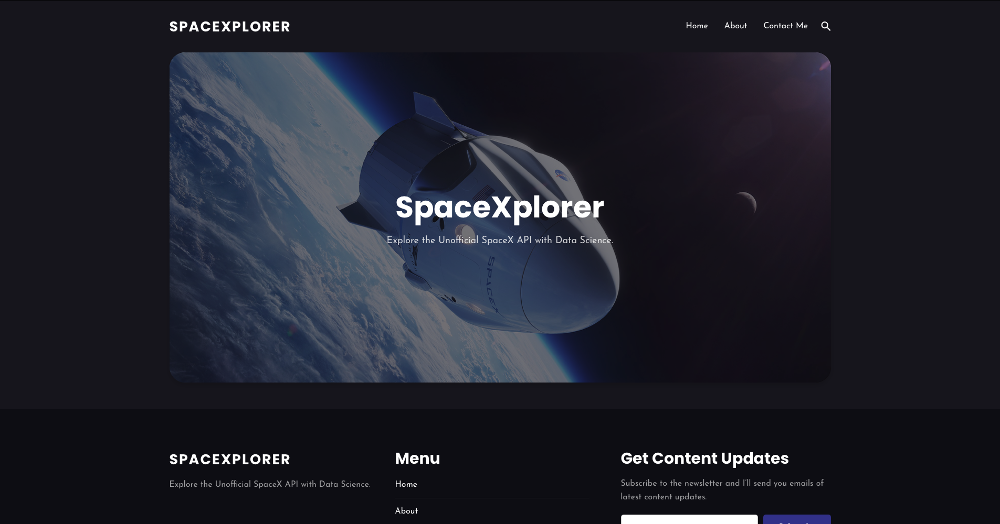

<!-- PROJECT LOGO -->
 

  

  <h3 align="center">SpaceXplorer</h3>

   

     Explore the Unofficial SpaceX API with Data Science.
      
     <a href="https://github.com/renatogusani/spacexplorer"><strong>Explore the docs »</strong></a>
      
      
     <a href="http://spacexplorer.info">View Site</a>
     ·
     <a href="https://github.com/renatogusani/spacexplorer">Report Bug</a>
     ·
     <a href="https://github.com/renatogusani/spacexplorer">Request Feature</a>
   

 

  

  

  

  

<!-- TABLE OF CONTENTS -->

  
Table of Contents

  <ol>
    <li>
      <a href="#about-the-project">About The Project</a>
    </li>
    <li><a href="#built-with">Built With</a></li>
    <li><a href="#roadmap">Roadmap</a></li>
    <li><a href="#contributing">Contributing</a></li>
    <li><a href="#license">License</a></li>
    <li><a href="#contact">Contact</a></li>
    <li><a href="#acknowledgments">Acknowledgments</a></li>
  </ol>

<!-- ABOUT THE PROJECT -->
## About SpaceXplorer

SpaceXplorer is a final year project created as part of my BSc in Data Science at National College of Ireland where I explore the SpaceX API with Data Science.

Here's what you can expect to find on SpaceXplorer.info:
* The SpaceX API exploration and findings visualized in an unforgettable experience of viewing content. 
* Machine Learning algorithms findings discussed thouroughly
* Live Statistics from the API

SpaceXplorer.info hosts all my findings from the Unofficial SpaceX API. Including but not limited to launch, rocket, core, capsule, starlink, launchpad, and landing pad data.

<h4 align="center">
  <i>
  SpaceXplorer is NOT affiliated, associated, authorized, endorsed by, or in any way officially connected with Space Exploration Technologies Corp
  (SpaceX), or any of its subsidiaries or its affiliates. The names SpaceX as well as related names, marks, emblems and images are registered
  trademarks of their respective owners.
  </i>
</h4>

(<a href="#top">back to top</a>)

### Built with

Including Framesworks/Libraries

* [![Python][Python.js]][Python-url]
* [![React][React.js]][React-url]
* [![Vue][Vue.js]][Vue-url]
* [![Angular][Angular.io]][Angular-url]
* [![Svelte][Svelte.dev]][Svelte-url]
* [![Laravel][Laravel.com]][Laravel-url]
* [![Bootstrap][Bootstrap.com]][Bootstrap-url]
* [![JQuery][JQuery.com]][JQuery-url]

(<a href="#top">back to top</a>)

<!-- ROADMAP -->
## Roadmap

- [x] Register Domain for SpaceXplorer.info
- [x] Create and edit landing page 
- [ ] Create and edit "About" tab on site
- [ ] Create and edit "Statistics" tab on site
- [ ] Analyse and run ML algorithms on SpaceX API with Python and Anaconda tools
- [ ] Query the SpaceX API with GraphQL
- [ ] Create and edit IEEE technical paper on the findings

<!-- LICENSE -->
## License

Distributed under the GNU General Public License v3.0. See `LICENSE.txt` for more information.

(<a href="#top">back to top</a>)

<!-- CONTACT -->
## Contact

- Email: renato.gusani@outlook.com
- LinkedIn: https://www.linkedin.com/in/rgusani/

(<a href="#top">back to top</a>)

<!-- ACKNOWLEDGMENTS -->
## Acknowledgments

Resources I found helpful and would like to give credit to!

* [SpaceX REST API](https://github.com/r-spacex/SpaceX-API)
* [Aditu](https://jekyllthemes.io/theme/aditu-blog-jekyll-theme)
* [Best-README-Template](https://github.com/othneildrew/Best-README-Template)
* [Google Domains](https://domains.google)
* [Google Analytics](https://analytics.google.com/analytics/web/provision/#/provision)
* [GitHub Pages](https://pages.github.com)
* [Canva](https://www.canva.com)
* [Choose an Open Source License](https://choosealicense.com)
* [Img Shields](https://shields.io)

(<a href="#top">back to top</a>)

<!-- MARKDOWN LINKS & IMAGES -->
<!-- https://www.markdownguide.org/basic-syntax/#reference-style-links -->
[product-screenshot]: images/screenshot.png
[Python.js]: https://img.shields.io/badge/python-000000?style=for-the-badge&logo=python&logoColor=cyan
[Python-url]: https://www.python.org
[React.js]: https://img.shields.io/badge/React-20232A?style=for-the-badge&logo=react&logoColor=61DAFB
[React-url]: https://reactjs.org/
[Vue.js]: https://img.shields.io/badge/Vue.js-35495E?style=for-the-badge&logo=vuedotjs&logoColor=4FC08D
[Vue-url]: https://vuejs.org/
[Angular.io]: https://img.shields.io/badge/Angular-DD0031?style=for-the-badge&logo=angular&logoColor=white
[Angular-url]: https://angular.io/
[Svelte.dev]: https://img.shields.io/badge/Svelte-4A4A55?style=for-the-badge&logo=svelte&logoColor=FF3E00
[Svelte-url]: https://svelte.dev/
[Laravel.com]: https://img.shields.io/badge/Laravel-FF2D20?style=for-the-badge&logo=laravel&logoColor=white
[Laravel-url]: https://laravel.com
[Bootstrap.com]: https://img.shields.io/badge/Bootstrap-563D7C?style=for-the-badge&logo=bootstrap&logoColor=white
[Bootstrap-url]: https://getbootstrap.com
[JQuery.com]: https://img.shields.io/badge/jQuery-0769AD?style=for-the-badge&logo=jquery&logoColor=white
[JQuery-url]: https://jquery.com 
